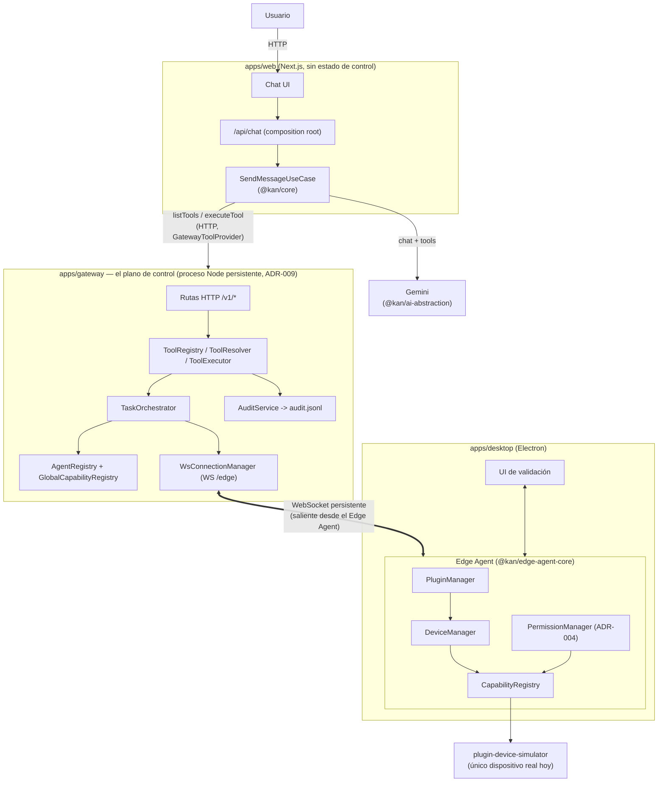
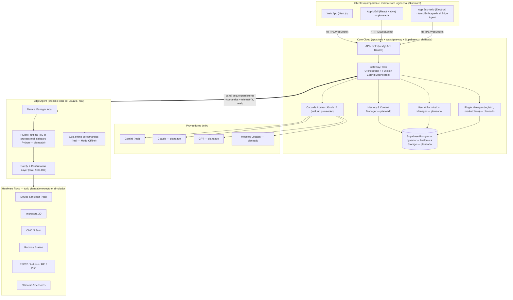

# Arquitectura General de KAN

> Ver [00-analisis-y-decisiones.md](00-analisis-y-decisiones.md) para el porqué de cada pieza, en particular el Edge Agent (ADR-001).
>
> **Estado real (v0.1):** lo que este documento llama "Core Cloud" se materializó como **dos procesos separados**, no uno: `apps/web` (Next.js — chat/BFF, sin estado propio de control) y `apps/gateway` (el plano de control real — Connection Manager, registries, orquestación, function-calling; ver [12-arquitectura-gateway.md](12-arquitectura-gateway.md)) — consistente con ADR-009: nada que mantenga conexiones persistentes puede vivir en las funciones serverless de Vercel donde corre `apps/web`. El diagrama de abajo sigue siendo correcto a nivel conceptual; para el detalle real de qué vive en qué proceso, ver docs/12.

## 1. Vista de alto nivel

### 1.1 Estado real (v0.1) — lo que corre hoy



**Lo que NO existe todavía y por qué el diagrama no lo muestra:** app móvil, Supabase/base de datos real (conversaciones en memoria, ADR-007), autenticación de usuario, más de un Edge Agent simultáneo probado, cualquier dispositivo físico real (ESP32/CNC/impresoras — el simulador es el único "dispositivo"). Ver `docs/13-auditoria-v0.1.md` y `docs/15-seguridad-v0.1.md` para el detalle de cada gap.

### 1.2 Visión a futuro (sin cambios respecto al diseño original)



## 2. Principio rector

**El Core Cloud nunca habla directo con el hardware.** Siempre pasa por el Edge Agent. El Core Cloud es "el cerebro que entiende y decide"; el Edge Agent es "las manos que ejecutan y protegen". Esta separación es lo que permite que KAN funcione en una LAN doméstica sin exponer puertos, y que siga funcionando (parcialmente) sin internet.

## 3. Capas (Clean Architecture) aplicadas a `@kan/core`

```
┌─────────────────────────────────────────┐
│  Interface Adapters                      │  ← API routes, WebSocket handlers,
│  (controllers, presenters, gateways)     │    CLI del Edge Agent
├─────────────────────────────────────────┤
│  Application (Use Cases)                 │  ← "EnviarMensaje", "InstalarPlugin",
│                                           │    "EjecutarComandoDispositivo"
├─────────────────────────────────────────┤
│  Domain (Entidades + Value Objects)      │  ← Conversation, Device, Plugin,
│                                           │    Permission, AgentTask (sin dependencias externas)
├─────────────────────────────────────────┤
│  Infrastructure                          │  ← Supabase repo, adaptadores de IA,
│  (implementaciones concretas)            │    drivers de dispositivo, colas
└─────────────────────────────────────────┘
```

Regla de dependencia: las capas internas (Domain) no conocen nada de las externas. Los adaptadores de IA y de dispositivos implementan **interfaces (puertos)** definidas en Domain/Application — esto es lo que permite cambiar de Gemini a Claude o añadir un dispositivo nuevo sin tocar el núcleo.

## 4. Los tres planos del sistema

| Plano | Dónde corre | Responsabilidad | Documento |
|---|---|---|---|
| **Cloud** | Vercel + Supabase | Entender, decidir, recordar, coordinar, gestionar usuarios/permisos/marketplace | [03](03-arquitectura-core.md) |
| **Edge** | Máquina del usuario (Electron) | Ejecutar contra hardware real, aplicar capa de seguridad, funcionar offline | [06](06-arquitectura-dispositivos.md) |
| **Plugins** | In-process (TS) o sidecar (Python) | Toda funcionalidad concreta, en ambos planos | [04](04-arquitectura-plugins.md) |

## 5. Ejemplo de flujo end-to-end

**Real, probado en v0.1** (ver `docs/05-arquitectura-ia.md` §3 para el diagrama de secuencia completo): "lee el sensor del simulador" → `SendMessageUseCase` pide tools al Gateway → Gemini propone `..._read_sensor` → `ToolResolver` valida que exista → `ToolExecutor`/`TaskOrchestrator` despachan por WS al Edge Agent → `CapabilityRegistry` ejecuta (severidad `read-only`, sin confirmación) → telemetría de vuelta → respuesta final en el chat, con la llamada a la herramienta visible en la conversación.

**Aspiracional, no implementado todavía** (detalle completo en doc 07): "KAN corta este archivo" →
1. Cliente envía mensaje al Core Cloud.
2. Orchestrator interpreta intención vía capa de IA, identifica plugin CNC/Láser y el dispositivo destino del usuario.
3. Task Coordinator crea una tarea, la clasifica como `irreversible-material` (ver ADR-004).
4. Se envía al Edge Agent del usuario junto con la instrucción de requerir confirmación.
5. Edge Agent genera preview/dry-run, lo muestra al usuario, espera confirmación explícita.
6. Confirmado → Safety Layer ejecuta vía el plugin de hardware correspondiente.
7. Telemetría de progreso sube al Core Cloud y se refleja en tiempo real en el cliente (Supabase Realtime).
