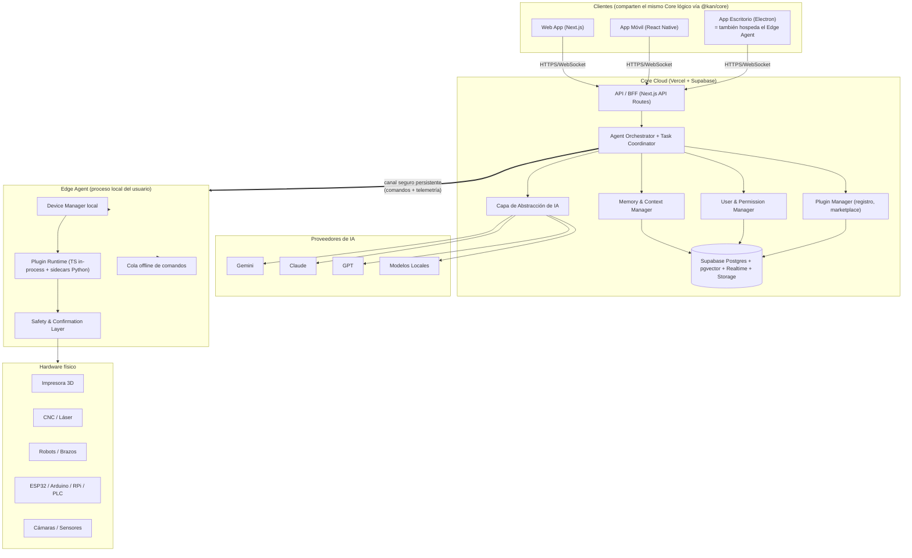

# Arquitectura General de KAN

> Ver [00-analisis-y-decisiones.md](00-analisis-y-decisiones.md) para el porqué de cada pieza, en particular el Edge Agent (ADR-001).

## 1. Vista de alto nivel



## 2. Principio rector

**El Core Cloud nunca habla directo con el hardware.** Siempre pasa por el Edge Agent. El Core Cloud es "el cerebro que entiende y decide"; el Edge Agent es "las manos que ejecutan y protegen". Esta separación es lo que permite que KAN funcione en una LAN doméstica sin exponer puertos, y que siga funcionando (parcialmente) sin internet.

## 3. Capas (Clean Architecture) aplicadas a `@kan/core`

```
┌─────────────────────────────────────────┐
│  Interface Adapters                      │  ← API routes, WebSocket handlers,
│  (controllers, presenters, gateways)     │    CLI del Edge Agent
├─────────────────────────────────────────┤
│  Application (Use Cases)                 │  ← "EnviarMensaje", "InstalarPlugin",
│                                           │    "EjecutarComandoDispositivo"
├─────────────────────────────────────────┤
│  Domain (Entidades + Value Objects)      │  ← Conversation, Device, Plugin,
│                                           │    Permission, AgentTask (sin dependencias externas)
├─────────────────────────────────────────┤
│  Infrastructure                          │  ← Supabase repo, adaptadores de IA,
│  (implementaciones concretas)            │    drivers de dispositivo, colas
└─────────────────────────────────────────┘
```

Regla de dependencia: las capas internas (Domain) no conocen nada de las externas. Los adaptadores de IA y de dispositivos implementan **interfaces (puertos)** definidas en Domain/Application — esto es lo que permite cambiar de Gemini a Claude o añadir un dispositivo nuevo sin tocar el núcleo.

## 4. Los tres planos del sistema

| Plano | Dónde corre | Responsabilidad | Documento |
|---|---|---|---|
| **Cloud** | Vercel + Supabase | Entender, decidir, recordar, coordinar, gestionar usuarios/permisos/marketplace | [03](03-arquitectura-core.md) |
| **Edge** | Máquina del usuario (Electron) | Ejecutar contra hardware real, aplicar capa de seguridad, funcionar offline | [06](06-arquitectura-dispositivos.md) |
| **Plugins** | In-process (TS) o sidecar (Python) | Toda funcionalidad concreta, en ambos planos | [04](04-arquitectura-plugins.md) |

## 5. Ejemplo de flujo end-to-end (resumen — detalle completo en doc 07)

"KAN corta este archivo" →
1. Cliente envía mensaje al Core Cloud.
2. Orchestrator interpreta intención vía capa de IA, identifica plugin CNC/Láser y el dispositivo destino del usuario.
3. Task Coordinator crea una tarea, la clasifica como `irreversible-material` (ver ADR-004).
4. Se envía al Edge Agent del usuario junto con la instrucción de requerir confirmación.
5. Edge Agent genera preview/dry-run, lo muestra al usuario, espera confirmación explícita.
6. Confirmado → Safety Layer ejecuta vía el plugin de hardware correspondiente.
7. Telemetría de progreso sube al Core Cloud y se refleja en tiempo real en el cliente (Supabase Realtime).
