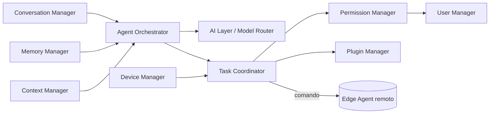

# Arquitectura del Core

El Core (según el README) es responsable únicamente de: comprender lenguaje natural, gestionar conversaciones, memoria, contexto, usuarios, permisos, dispositivos, plugins, modelos de IA, coordinar tareas y orquestar agentes. Todo lo demás es plugin. Aquí se detalla cada módulo como caso de uso de `packages/core`.

## 1. Módulos y sus responsabilidades

### 1.1 Conversation Manager
- Persiste hilos de conversación (multi-turno, multi-dispositivo — un usuario puede seguir la misma conversación en web y móvil).
- Normaliza entrada multimodal (texto, voz transcrita, imagen) en un formato interno único antes de pasarlo al Agent Orchestrator.
- No interpreta intención — eso es responsabilidad del Agent Orchestrator + capa de IA.

### 1.2 Memory Manager
- Memoria de corto plazo: contexto de la conversación activa (ventana de turnos recientes).
- Memoria de largo plazo: hechos persistentes sobre el usuario y su entorno ("mi impresora es una Ender 3", "mi taller usa G-code marca X"), almacenados como embeddings (pgvector) + metadatos estructurados.
- Expone una interfaz de recuperación (`recallRelevant(query, userId)`) consumida por el Agent Orchestrator para enriquecer el prompt — es la base del RAG interno (ver doc 05).

### 1.3 Context Manager
- Mantiene el "estado de la sesión": qué dispositivos están conectados ahora mismo, qué plugin está activo, qué tarea está en curso.
- Distinto de Memory: Context es efímero y operacional; Memory es persistente y de conocimiento.

### 1.4 User Manager
- Identidad, autenticación (Supabase Auth), perfil, preferencias, multi-tenant desde el día uno (workspace/organización) aunque el MVP solo tenga un usuario por cuenta — evita una migración de esquema dolorosa en Fase 2.

### 1.5 Permission Manager
- Modelo de permisos de dos niveles: **permisos de usuario** (qué puede hacer cada humano en el sistema — admin, operador, invitado) y **permisos de plugin** (qué puede hacer cada plugin — ver ADR-008 en doc 00).
- Aplica la clasificación de severidad de acciones (ADR-004): decide cuándo una acción requiere confirmación explícita antes de llegar al Edge Agent.
- Es el único módulo autorizado a aprobar la ejecución de una tarea `irreversible-material` o `safety-critical`.

### 1.6 Device Manager (plano Cloud)
- Registro lógico de dispositivos del usuario (metadatos: tipo, capacidades, plugin asociado, Edge Agent al que pertenece). **No** se conecta directo al hardware — eso es el Device Manager del Edge Agent (doc 06). Este es el "directorio", el otro es la "ejecución".

### 1.7 Plugin Manager (plano Cloud)
- Registro de plugins instalados por usuario/workspace, versión, estado (activo/inactivo), permisos concedidos.
- En Fase 2: catálogo del marketplace, verificación de firma, actualización.

### 1.8 Model Manager
- Registro de qué proveedor(es) de IA están disponibles/configurados por usuario o por defecto del sistema.
- Expone políticas de selección (costo, latencia, capacidad de function-calling) al Model Router (doc 05).

### 1.9 Task Coordinator
- Convierte una intención resuelta ("cortar este archivo en la CNC X") en una `AgentTask` con: plugin destino, payload, nivel de severidad, Edge Agent destino, estado (`pending → awaiting_confirmation → executing → done/failed`).
- Es el punto donde se aplica la Safety Layer a nivel Cloud antes de despachar al Edge Agent.

### 1.10 Agent Orchestrator
- El "cerebro": recibe el mensaje normalizado + contexto + memoria relevante, decide (con ayuda del LLM vía function-calling) qué plugin(s)/tool(s) invocar, en qué orden, y con qué parámetros.
- Soporta tareas multi-paso ("diseña esta pieza" → plugin CAD genera modelo → usuario aprueba → plugin 3D printing la imprime), coordinando múltiples `AgentTask` encadenadas.

## 2. Diagrama de dependencias entre módulos

## 3. Regla de oro

Ningún módulo del Core conoce el detalle de un dispositivo o proveedor de IA específico. Todo pasa por los puertos definidos en `packages/core/src/ports`: `AIProviderPort`, `DevicePort`, `PluginPort`. Esto es lo que hace que añadir Gemini→Claude o Impresora→CNC nuevo sea trabajo de infraestructura, no de negocio.
