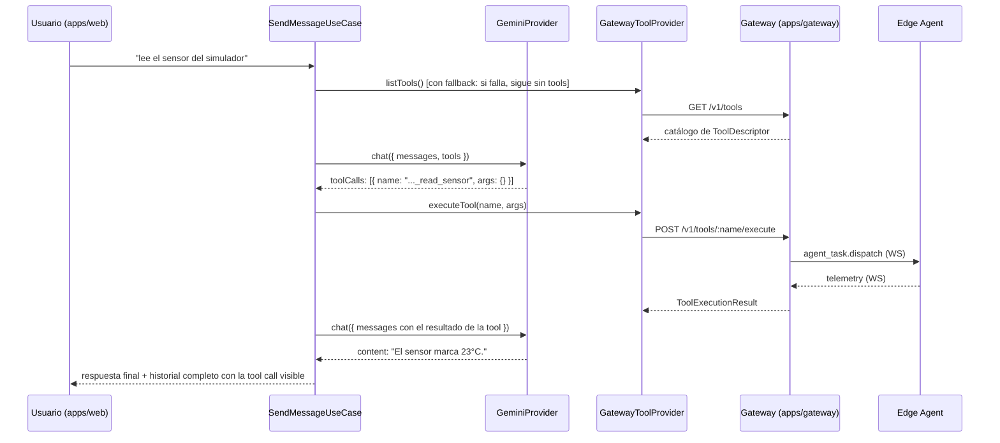

# Arquitectura de IA

> **Estado real en v0.1** (actualizado tras el incremento del Gateway y la estabilización — `docs/12`, `docs/13`): la capa de abstracción de proveedores y el function-calling **ya están implementados**, no son diseño aspiracional. `chatStream`/`embed`/multi-proveedor con fallback real siguen siendo trabajo futuro — ver la nota al final de cada sección.

## 1. Capa de abstracción de proveedores (`@kan/ai-abstraction`)

Ningún módulo del Core llama directo al SDK de Gemini, Claude o GPT. Todos pasan por una interfaz común (forma real implementada en `packages/core/src/domain/ports/AIProviderPort.ts`):

```ts
interface ChatRequest {
  messages: Message[];
  systemPrompt?: string;
  tools?: ToolDescriptor[]; // capabilities disponibles, expuestas como function-calling
}

interface ChatResponse {
  content?: string;
  toolCalls?: ToolCallProposal[]; // el modelo solo propone — nunca ejecuta (docs/12 §5)
}

interface AIProviderPort {
  readonly providerName: string;
  chat(request: ChatRequest): Promise<ChatResponse>;
}
```

`GeminiProvider` (`packages/ai-abstraction`) es la única implementación real hoy: traduce `tools` al formato `functionDeclarations` de Gemini y mapea el historial de mensajes (incluyendo turnos `tool`/`assistant-con-toolCall`) a los roles `function`/`model` que exige el SDK. **No** se adoptó el Vercel AI SDK como capa base — la superficie que necesitábamos (function-calling + streaming de texto simple) era pequeña y se implementó directo contra el SDK oficial de cada proveedor, evitando una dependencia adicional cuyo abstraction layer no terminábamos de necesitar. `chatStream`/`embed` (streaming real, memoria vectorial) siguen sin implementarse — ver docs/00 sección 4 sobre qué se recortó deliberadamente del alcance de v0.1.

## 2. Model Router

`ModelRouter` (`packages/ai-abstraction/src/router.ts`) existe como capa de indirección — el `SendMessageUseCase` habla con `ModelRouter`, nunca directo con `GeminiProvider`. **Hoy reenvía a un único proveedor configurado**, sin fallback real todavía (no hay un segundo proveedor implementado al que caer). El registro de uso/costo por proveedor tampoco está implementado. Esto quedó identificado explícitamente como brecha documentación-vs-código en la auditoría de estabilización (`docs/13` M11) — se documenta aquí para que quede honesto: la interfaz está lista para fallback multi-proveedor, la lógica de fallback en sí es trabajo futuro (se activa el día que exista un segundo `AIProviderPort` real).

## 3. Agent Orchestrator: de lenguaje natural a acción

**Implementado como `SendMessageUseCase`** (`packages/core/src/application/use-cases/SendMessageUseCase.ts`), más simple que el diagrama conceptual original: no hay módulos separados de "Conversation Manager"/"Memory Manager"/"Task Coordinator" todavía — esa separación es donde crecerá el caso de uso cuando exista Memory real (RAG, sección 4) y tareas multi-paso genuinas. El flujo real, probado en `SendMessageUseCase.test.ts` y validado end-to-end contra Gemini real:



- Las **capabilities de los Edge Agents conectados se exponen al LLM como "tools"** vía el Gateway (`GlobalCapabilityRegistry` → `ToolRegistry`, docs/12 §3 y §5) — este es el mecanismo central, ya implementado: el LLM nunca controla hardware directamente, solo puede *proponer* invocar una tool; `ToolResolver` + `ToolExecutor` + `TaskOrchestrator` deciden si y cómo se ejecuta.
- Límite de 4 rondas de tool-calling y de 45s de duración total (`docs/13` A11) para no colgar la request ni acercarse a límites de función serverless (ADR-001).
- Tareas multi-paso genuinas (ej. "diseña y luego imprime esta pieza") siguen sin implementar — hoy cada ronda invoca como máximo las tools que el modelo proponga en un mismo turno; la decomposición en subtareas encadenadas con puntos de aprobación intermedios es la extensión natural de `TaskOrchestrator.submit()` documentada como seam en `docs/12` §4, no construida todavía.

## 4. Memoria y RAG

- **Memoria de largo plazo** como embeddings en Supabase `pgvector`: hechos sobre el usuario, su hardware, sus proyectos previos.
- Antes de cada turno relevante, el Memory Manager recupera los top-k fragmentos relevantes y los inyecta en el prompt (RAG clásico), evitando enviar todo el historial cada vez (control de costo y de límite de contexto).
- Memoria de corto plazo (ventana de conversación) se resume automáticamente cuando excede un umbral de tokens, para conversaciones largas de proyectos que duran semanas.

## 5. Multi-agente (Fase 2, diseñado desde ya para no reescribir)

Para tareas complejas ("automatiza mi laboratorio"), un único orquestador monolítico no escala bien. Se define desde ahora la interfaz `Agent` como abstracción (no solo "el" orquestador), de forma que en Fase 2 se puedan introducir agentes especializados (ej. "Agente de Diseño", "Agente de Fabricación") coordinados por un **Planner** de nivel superior — sin cambiar el contrato que ven los plugins.

## 6. Seguridad de la capa de IA

> Ver `docs/15-seguridad-v0.1.md` sección 9 para el análisis formal de ataques (incluido prompt injection) contra el estado real del sistema.


- **Prompt injection vía contenido de dispositivos/sensores**: si un plugin de visión artificial pasa texto reconocido de una cámara al LLM, ese texto es *input no confiable* y no debe poder alterar permisos ni ejecutar tools directamente — se trata igual que input de usuario no autenticado.
- El LLM **propone**, nunca **autoriza**. La autorización de acciones con severidad `irreversible-material`/`safety-critical` siempre pasa por el Permission Manager y confirmación humana (ADR-004), nunca por decisión unilateral del modelo.
