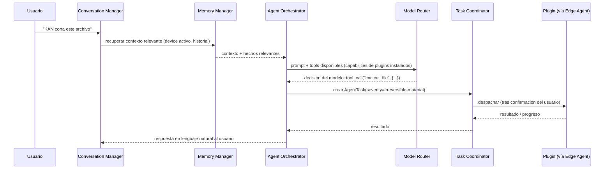

# Arquitectura de IA

## 1. Capa de abstracción de proveedores (`@kan/ai-abstraction`)

Ningún módulo del Core llama directo al SDK de Gemini, Claude o GPT. Todos pasan por una interfaz común:

```ts
interface AIProviderPort {
  chat(input: ChatRequest): Promise<ChatResponse>;
  chatStream(input: ChatRequest): AsyncIterable<ChatChunk>;
  embed(input: string[]): Promise<number[][]>;
  supportsToolCalling(): boolean;
}
```

Cada proveedor (Gemini, Claude, GPT, modelo local vía Ollama) implementa este puerto en `src/providers/<proveedor>`. Se recomienda apoyarse en el **Vercel AI SDK** como capa base de bajo nivel (ya resuelve streaming y normalización de tool-calling entre proveedores), y construir `AIProviderPort` como una capa fina encima, propia de KAN, para no acoplar el dominio directamente a una librería de terceros.

## 2. Model Router

- Selecciona el proveedor activo según: preferencia del usuario/workspace, disponibilidad (fallback si Gemini free-tier da rate-limit), capacidad requerida (function-calling, contexto largo, visión), y costo.
- Política de fallback en cadena: `preferido → alternativa configurada → modelo local (si offline)`.
- Registra uso por proveedor (tokens, costo estimado) — necesario desde el MVP para no tener sorpresas de facturación al salir del free tier.

## 3. Agent Orchestrator: de lenguaje natural a acción



- Las **capabilities de los plugins instalados se exponen al LLM como "tools"** (function calling nativo del proveedor). Este es el mecanismo central: el LLM nunca controla hardware directamente, solo puede *proponer* invocar una tool, y el Task Coordinator + Permission Manager deciden si se ejecuta.
- Tareas multi-paso (ej. "diseña y luego imprime esta pieza") se modelan como una secuencia de `AgentTask` encadenadas, con puntos de aprobación del usuario entre pasos críticos.

## 4. Memoria y RAG

- **Memoria de largo plazo** como embeddings en Supabase `pgvector`: hechos sobre el usuario, su hardware, sus proyectos previos.
- Antes de cada turno relevante, el Memory Manager recupera los top-k fragmentos relevantes y los inyecta en el prompt (RAG clásico), evitando enviar todo el historial cada vez (control de costo y de límite de contexto).
- Memoria de corto plazo (ventana de conversación) se resume automáticamente cuando excede un umbral de tokens, para conversaciones largas de proyectos que duran semanas.

## 5. Multi-agente (Fase 2, diseñado desde ya para no reescribir)

Para tareas complejas ("automatiza mi laboratorio"), un único orquestador monolítico no escala bien. Se define desde ahora la interfaz `Agent` como abstracción (no solo "el" orquestador), de forma que en Fase 2 se puedan introducir agentes especializados (ej. "Agente de Diseño", "Agente de Fabricación") coordinados por un **Planner** de nivel superior — sin cambiar el contrato que ven los plugins.

## 6. Seguridad de la capa de IA

- **Prompt injection vía contenido de dispositivos/sensores**: si un plugin de visión artificial pasa texto reconocido de una cámara al LLM, ese texto es *input no confiable* y no debe poder alterar permisos ni ejecutar tools directamente — se trata igual que input de usuario no autenticado.
- El LLM **propone**, nunca **autoriza**. La autorización de acciones con severidad `irreversible-material`/`safety-critical` siempre pasa por el Permission Manager y confirmación humana (ADR-004), nunca por decisión unilateral del modelo.
