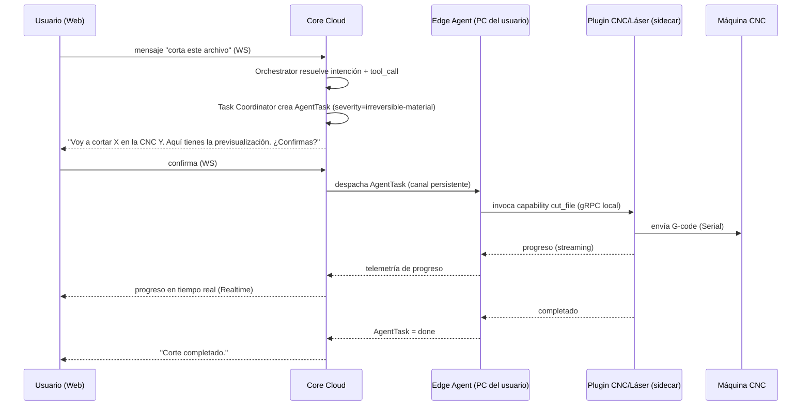

# Arquitectura de Comunicación

> **Estado real (v0.1):** el servidor del lado "Core Cloud ↔ Edge Agent" **ya existe y está probado** — es `apps/gateway` / `WsConnectionManager` (`docs/12` §1), no un incremento pendiente como decía una versión anterior de este documento. Diferencias concretas con la tabla de abajo: sin mTLS todavía (token compartido + `timingSafeEqual`, ver `docs/15-seguridad-v0.1.md`), sin Supabase Realtime (el cliente web recibe la respuesta por el propio request HTTP, no por push), sin JWT/RLS (sin autenticación de usuario todavía — mismo gap documentado en `docs/13`/`docs/15`).

## 1. Matriz de comunicación

| Origen → Destino | Protocolo | Naturaleza | Notas de seguridad |
|---|---|---|---|
| Cliente (web/mobile/desktop) → Core Cloud | HTTPS (REST) + WebSocket | Request/response para acciones; WS para chat en tiempo real y progreso | JWT (Supabase Auth), rate limiting |
| Core Cloud → Cliente | Supabase Realtime (sobre WebSocket) | Push de estado de tareas, telemetría de dispositivos | Suscripción con RLS (row-level security) por usuario |
| Core Cloud ↔ Edge Agent | WebSocket persistente saliente desde el Edge Agent (nunca entrante) | Comandos (Cloud→Edge) + telemetría/heartbeat (Edge→Cloud) | mTLS o token de larga duración rotable + heartbeat; reconexión con backoff; cola local si cae |
| Edge Agent ↔ Plugin sidecar | gRPC (o WebSocket local) | Invocación de capabilities, streaming de progreso | Solo loopback/socket local, nunca expuesto a la red |
| Edge Agent ↔ Dispositivo físico | Serial/USB, MQTT, HTTP, Bluetooth (ver doc 06) | Nativo del dispositivo | Validación de payload antes de enviar al hardware (defensa en profundidad) |
| Core Cloud → Proveedores de IA | HTTPS (SDK del proveedor) | Request/response o streaming | Claves por variable de entorno/secret manager, nunca en cliente |
| Marketplace (Fase 2) → Cliente/Edge Agent | HTTPS + verificación de firma | Descarga de paquete de plugin | Paquete firmado, hash verificado antes de ejecutar |

## 2. Por qué el canal Core↔Edge Agent es siempre saliente desde el Edge Agent

El Edge Agent vive detrás de NAT/firewall doméstico. Si el Core Cloud tuviera que "llamar" al Edge Agent, requeriría exponer un puerto en la red del usuario (inseguro, mala UX). En cambio, el Edge Agent abre y mantiene la conexión hacia afuera (como hace cualquier app de chat o IoT comercial: Slack, Home Assistant Cloud, etc.), y el Core Cloud empuja comandos sobre esa conexión ya establecida.

## 3. Ejemplo end-to-end: "KAN corta este archivo"



## 4. Formato de mensaje entre Core y Edge Agent (contrato de alto nivel)

```json
{
  "type": "agent_task.dispatch",
  "taskId": "uuid",
  "capability": "cnc.cut_file",
  "severity": "irreversible-material",
  "requiresConfirmation": false,
  "payload": { "fileUrl": "...", "deviceId": "..." },
  "issuedAt": "2026-08-06T12:00:00Z"
}
```
`requiresConfirmation: false` porque la confirmación ya ocurrió en el Core Cloud antes de despachar (paso previo). El Edge Agent igual puede exigir una segunda confirmación local/dry-run si el plugin lo declara (`supportsDryRun`), como defensa en profundidad.

## 5. Versionado del contrato

`plugin-contract` y el protocolo Core↔Edge Agent se versionan semánticamente desde el primer release. Un Edge Agent desactualizado debe poder rechazar comandos de una versión de contrato que no entiende, en vez de fallar de forma impredecible contra hardware real.
