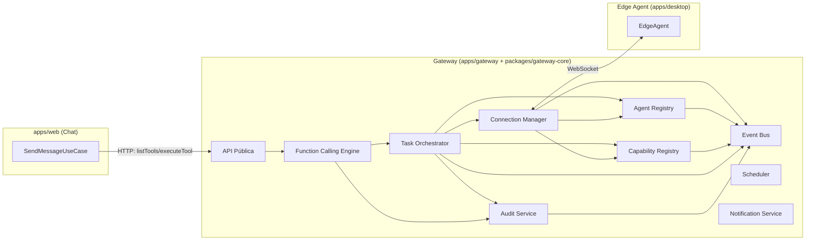

# Arquitectura del Gateway (Plano de Control de KAN)

> Este documento define la arquitectura **definitiva** del Gateway: los 10 módulos, sus interfaces y la separación de responsabilidades entre ellos. No todo lo que aquí se define se implementa en el primer incremento — cada sección dice explícitamente qué está implementado hoy y qué es un seam preparado para crecer sin reescritura (petición explícita del usuario: 5 años sin reescritura completa).

## 0. Qué es el Gateway y por qué existe

Hasta ahora, "Core Cloud" era un término un poco difuso que cubría "todo lo que no es el Edge Agent". Con este incremento se vuelve concreto: **el Gateway es el plano de control (control plane) de KAN**. Es el proceso persistente (ADR-001/ADR-009, `docs/00`) donde viven todas las conexiones de Edge Agents, el catálogo global de qué se puede hacer ahora mismo, y la decisión de cómo ejecutar lo que el usuario pide.

`apps/web` (el chat) deja de hablar directo con proveedores de IA para "hacer cosas" — solo conversa y le pregunta al Gateway "¿qué herramientas hay?" y "ejecuta esta". El Gateway es quien sabe qué Edge Agents existen, qué exponen, y cómo llegar a ellos.



## 1. Connection Manager

**Responsabilidad.** El único módulo que toca el transporte WebSocket real. Acepta conexiones entrantes de Edge Agents (el WS siempre es saliente desde el Edge Agent — ADR-001/docs/07), valida el token de autenticación y la versión de protocolo en el handshake, mantiene el mapa `edgeAgentId → conexión viva`, detecta heartbeats perdidos y cierra conexiones muertas.

**No hace:** no sabe qué es un "agente" en términos de negocio (eso es Agent Registry), no decide qué capability invocar (eso es Task Orchestrator). Es pura gestión de transporte.

```ts
interface ConnectionManagerPort {
  start(): void;
  stop(): void;
  send(edgeAgentId: string, message: CoreToEdgeMessage): boolean; // false si no hay conexión viva
  onAgentConnected(handler: (info: AgentConnectionInfo) => void): void;
  onAgentDisconnected(handler: (edgeAgentId: string) => void): void;
  onMessage(handler: (edgeAgentId: string, message: EdgeToCoreMessage) => void): void;
  getState(edgeAgentId: string): "connected" | "disconnected";
}

interface AgentConnectionInfo {
  edgeAgentId: string;
  protocolVersion: string;
  connectedAt: string;
}
```

**Implementado en este incremento:** `WsConnectionManager` (paquete `ws`, servidor HTTP compartido con la API pública — ver sección 10). Rechaza conexiones cuya versión mayor de protocolo no coincide con `PROTOCOL_VERSION` (`packages/plugin-contract`). Cierra conexiones sin heartbeat en más de 45s.

## 2. Agent Registry

**Responsabilidad.** El inventario lógico y durable de cada Edge Agent que se ha conectado alguna vez: estado (online/offline), versión de protocolo, sistema operativo, versión del propio Edge Agent, plugins instalados, dispositivos conectados. Distinto del Connection Manager: la conexión es transporte efímero, el registro es el "quién es quién" del sistema.

```ts
interface AgentRecord {
  edgeAgentId: string;
  status: "online" | "offline";
  protocolVersion: string;
  os?: string;
  agentVersion?: string;
  installedPlugins: PluginManifest[];
  devices: Array<{ id: string; name: string; kind: string }>;
  lastSeenAt: string;
}

interface AgentRegistryPort {
  upsert(record: AgentRecord): void;
  markOnline(edgeAgentId: string): void;
  markOffline(edgeAgentId: string): void;
  get(edgeAgentId: string): AgentRecord | undefined;
  list(): AgentRecord[];
}
```

**Implementado en este incremento:** `InMemoryAgentRegistry`. Se puebla a partir del mensaje `hello` (protocolo extendido — ver sección 5) que cada Edge Agent envía al conectar. Migrar a persistencia real (Supabase) es swap de adaptador, mismo patrón que ADR-007.

## 3. Capability Registry (global, del lado del Gateway)

**No confundir con el `CapabilityRegistry` del Edge Agent** (`packages/edge-agent-core`, docs del incremento anterior) — ese es local a un Edge Agent. Este agrega las capabilities de **todos** los Edge Agents conectados en un catálogo único, con una referencia estable (`ref`) que sirve tanto para enrutar como para nombrar la herramienta ante el LLM.

```ts
interface GlobalCapability {
  ref: string; // único, seguro para usarse como nombre de tool del LLM
  edgeAgentId: string;
  deviceId: string;
  capability: CapabilityDescriptor;
}

interface GlobalCapabilityRegistryPort {
  sync(edgeAgentId: string, capabilities: Array<{ deviceId: string; capability: CapabilityDescriptor }>): void;
  removeAgent(edgeAgentId: string): void; // al desconectar
  list(): GlobalCapability[];
  resolve(ref: string): GlobalCapability | undefined;
}
```

**Resolución de conflictos y versionado (diseño, no todo implementado):** como `ref` siempre incluye `edgeAgentId` y `deviceId`, dos agentes pueden exponer una capability con el mismo nombre (`toggle_led`) sin colisión — cada una tiene su propio `ref`. El "conflicto" real a resolver en el futuro es otro: cuando el usuario tiene *varios* dispositivos que sirven la misma intención ("enciende la impresora" con dos impresoras conectadas) y hay que decidir cuál. Eso es responsabilidad del Task Orchestrator (desambiguación, sección 4), no de este registro — el registro solo agrega y expone, no decide. El versionado de una capability sigue el `version` del `PluginManifest` del plugin que la declara; un cambio de versión mayor puede coexistir con el `ref` anterior hasta que el agente viejo se desconecte.

**Implementado en este incremento:** `InMemoryGlobalCapabilityRegistry`, con `sync()` disparado por el `hello` del Connection Manager.

## 4. Task Orchestrator

**Responsabilidad.** Recibe una solicitud de ejecución ya resuelta a una capability concreta (`capabilityRef` + `input`), decide el destino real (vía Agent Registry + Capability Registry), la despacha por el Connection Manager, y resuelve cuando llega la telemetría de vuelta. Es el único lugar que crea y trackea `GatewayTask`.

```ts
interface TaskRequest {
  capabilityRef: string;
  input: unknown;
}

interface TaskResult {
  status: "done" | "failed" | "pending_confirmation";
  data?: unknown;
  error?: string;
  confirmationId?: string;
}

interface TaskOrchestratorPort {
  submit(request: TaskRequest): Promise<TaskResult>;
  getTask(taskId: string): GatewayTask | undefined;
}

interface GatewayTask {
  id: string;
  capabilityRef: string;
  status: "dispatched" | "done" | "failed" | "pending_confirmation";
  createdAt: string;
}
```

**Decisión de seguridad deliberada:** cuando el Edge Agent responde `pending_confirmation` (porque la capability es `irreversible-material`/`safety-critical`, ADR-004), el Task Orchestrator **no** intenta resolverlo por chat — resuelve inmediatamente con `status:"pending_confirmation"` y dirige al usuario a confirmar en la propia app del Edge Agent (que ya muestra el modal, sin cambios). Esto es intencional, no una limitación temporal: mantiene la confirmación de acciones físicas peligrosas atada al dispositivo físico/local, no a un canal de chat que podría ser remoto. Documentado aquí para que quede como decisión de arquitectura, no como olvido.

**Diseño para tareas complejas y paralelismo (seam, no implementado):** `submit()` hoy acepta un único `TaskRequest`. La extensión natural — ya prevista para no requerir reescritura — es un `submitPlan(plan: TaskPlan)` donde `TaskPlan = { steps: TaskRequest[], edges: Array<[stepIndexA, stepIndexB]> }` (grafo de dependencias). Los pasos sin dependencias entre sí se despachan en paralelo (`Promise.all`); los que dependen de otro esperan su resultado. No se implementa ahora porque no hay todavía un caso de uso real de tarea compuesta — se agrega cuando el primer plugin que lo necesite exista (ej. "diseña e imprime esta pieza", Fase 2 del roadmap).

**Implementado en este incremento:** `TaskOrchestrator` con `submit()` de un solo paso, timeout de 15s si no llega telemetría.

## 5. Function Calling Engine

**El requisito explícito del usuario: no acoplar esto a Gemini.** El proveedor de IA solo **sugiere** — nunca ejecuta. Tres piezas separadas:

```ts
// Lo que el LLM ve (independiente del proveedor)
interface ToolDescriptor {
  name: string; // = GlobalCapability.ref
  description: string;
  inputSchema: JsonSchema; // JSON Schema real desde ADR-024 (docs/16 P1)
}

interface ToolRegistry {
  list(): ToolDescriptor[];
  get(name: string): ToolDescriptor | undefined;
}

// Traduce la propuesta cruda del LLM (nombre + args) a una llamada válida y conocida
type ToolResolution = { ok: true; call: { ref: string; args: unknown } } | { ok: false; error: string };
interface ToolResolver {
  resolve(proposedName: string, rawArgs: unknown): ToolResolution;
}

// El único lugar que decide CÓMO ejecutar — aquí es donde KAN, no el LLM, tiene el control
interface ToolExecutionResult {
  success: boolean;
  data?: unknown;
  error?: string;
  requiresConfirmation?: boolean;
}
interface ToolExecutor {
  execute(call: { ref: string; args: unknown }): Promise<ToolExecutionResult>;
}
```

**Flujo:** `AIProviderPort.chat()` (implementado hoy por `GeminiProvider`, mañana por Claude/GPT/local sin cambiar nada de esto) recibe la lista de `ToolDescriptor` y devuelve, como máximo, una **propuesta** (`{name, args}`). `ToolResolver.resolve()` valida que ese nombre exista en el `ToolRegistry` real — si el LLM alucina un nombre, se rechaza aquí, antes de tocar nada — y, desde ADR-024, valida además los `args` contra el `inputSchema` (JSON Schema real) de esa tool, primera de las dos capas de defensa en profundidad (la segunda vive en `CapabilityRegistry`, del lado del Edge Agent). `ToolExecutor.execute()` es quien realmente llama al `TaskOrchestrator` (pasando antes por Audit Service). Ningún proveedor de IA tiene una línea de código que toque `TaskOrchestrator` — ese acoplamiento no existe ni puede existir por diseño.

**Implementado en este incremento:** `CapabilityBackedToolRegistry`, `RegistryToolResolver`, `OrchestratorToolExecutor` (los tres respaldados por lo construido en las secciones 3 y 4). **Validación real de `inputSchema`:** ADR-024 (docs/00), `docs/16` P1.

## 6. Audit Service

**Responsabilidad.** Registro append-only de toda acción: propuestas del LLM, ejecuciones, resultados, confirmaciones. Es la base de los requisitos legales de trazabilidad ya identificados en `docs/11-riesgos.md`.

```ts
interface AuditEntry {
  id: string;
  at: string;
  actor: "llm" | "user" | "system";
  action: string; // ej. "tool.execute", "tool.proposed"
  subject: string; // capabilityRef, taskId, etc.
  metadata: Record<string, unknown>;
}

interface AuditStorePort {
  append(entry: AuditEntry): Promise<void>; // async desde ADR-026 (docs/16 P3)
  list(filter?: Partial<Pick<AuditEntry, "actor" | "action" | "subject">>): Promise<AuditEntry[]>;
}
```

**Implementado en este incremento:** `AuditService` (genera id/timestamp, emite evento en el bus) sobre `JsonlAuditStore` (un archivo `.jsonl` local, un registro por línea — durable entre reinicios sin necesitar todavía una base de datos real). **Persistencia real (ADR-026, docs/16 P3):** `apps/gateway` usa `SupabaseAuditStore` (`@kan/supabase-adapter`, tabla `audit_entries`, `service_role` key) en su lugar; `JsonlAuditStore` sigue disponible como implementación sin dependencias externas.

## 7. Event Bus

Mismo patrón que `EdgeAgentBus` (incremento anterior, ya probado): un `EventEmitter` tipado que desacopla los módulos del Gateway entre sí. Nadie llama directo a otro módulo para notificar algo — emite en el bus.

```ts
interface GatewayEvents {
  "agent.connected": { edgeAgentId: string };
  "agent.disconnected": { edgeAgentId: string };
  "capability.synced": { edgeAgentId: string; count: number };
  "task.dispatched": { taskId: string; capabilityRef: string };
  "task.completed": { taskId: string; result: TaskResult };
  "task.failed": { taskId: string; error: string };
  "tool.proposed": { name: string; args: unknown };
  "tool.executed": { name: string; result: ToolExecutionResult };
  "audit.recorded": { entry: AuditEntry };
}
```

**Implementado en este incremento:** `GatewayBus`, idéntico en forma a `EdgeAgentBus`.

## 8. Scheduler

**Seam preparado, no implementado.** La interfaz existe para que, cuando haya un primer caso de uso real (ej. "riega el jardín todos los días a las 7am"), se conecte sin rediseñar nada alrededor.

```ts
interface ScheduledJob {
  id: string;
  taskRequest: TaskRequest;
  cron?: string; // futuro: recurrente
  runAt?: string; // futuro: una sola vez
}

interface SchedulerPort {
  schedule(job: Omit<ScheduledJob, "id">): string;
  cancel(jobId: string): void;
  list(): ScheduledJob[];
}
```

**Implementado en este incremento:** `NoopScheduler` — `schedule()` registra el job en una lista mas no lo ejecuta nunca (deja constancia explícita en el log de que la ejecución real no está implementada, en vez de fallar silenciosamente).

## 9. Notification Service

**Seam preparado, no implementado.** Para cuando KAN necesite avisar proactivamente ("tu impresión terminó", "el sensor detectó algo") por canales fuera del chat activo.

```ts
interface Notification {
  userId: string;
  channel: "chat" | "push" | "email" | "sms";
  title: string;
  body: string;
  severity?: "info" | "warning" | "critical";
}

interface NotificationServicePort {
  notify(notification: Notification): Promise<void>;
}
```

**Implementado en este incremento:** `ConsoleNotificationService` — solo loguea, no envía nada de verdad todavía.

## 10. API Pública

**Responsabilidad.** La superficie HTTP del Gateway. Hoy la consume únicamente `apps/web` (internamente), pero se diseña desde ya versionada (`/v1/...`) porque en el roadmap (Fase 2+, `docs/09`) esta es la misma API que consumirán aplicaciones de terceros del futuro marketplace.

| Endpoint | Método | Uso hoy |
|---|---|---|
| `/v1/tools` | GET | Lista de `ToolDescriptor` — lo que `apps/web` pasa al LLM |
| `/v1/tools/:name/execute` | POST | Resuelve + ejecuta una tool (`ToolResolver` + `ToolExecutor`) |
| `/v1/agents` | GET | `AgentRegistry.list()` — observabilidad |
| `/v1/audit` | GET | `AuditService.list()` — observabilidad/depuración |

Autenticada con un token compartido simple por ahora (`KAN_GATEWAY_INTERNAL_TOKEN`) — el mismo lugar donde, cuando exista el marketplace, se añadirán API keys por aplicación de terceros sin cambiar la forma de los endpoints.

**Implementado en este incremento:** los 4 endpoints, con Express sobre el mismo `http.Server` que aloja el WebSocket del Connection Manager (un solo puerto, un solo proceso).

## 11. Por qué esto crece 5 años sin reescritura

Cada módulo tiene una interfaz explícita y una sola responsabilidad. Los tres módulos "seam" (Scheduler, Notification Service, y la desambiguación multi-dispositivo del Task Orchestrator) existen en la arquitectura *antes* de tener implementación real — así, cuando llegue el primer caso de uso que los necesite, es cableado, no rediseño. El Function Calling Engine es, por diseño, imposible de acoplar a un proveedor de IA específico: `ToolRegistry`/`ToolResolver`/`ToolExecutor` no importan nada de `@kan/ai-abstraction`, y `@kan/ai-abstraction` no importa nada del Gateway — se comunican únicamente a través de `ToolDescriptor`/`ToolCallProposal`, tipos neutrales en `packages/plugin-contract`.

## 12. Documentos relacionados

- [00 — Análisis y Decisiones](00-analisis-y-decisiones.md) — ADR-001 (Edge Agent), ADR-009 (Core Gateway como servicio separado)
- [05 — Arquitectura de IA](05-arquitectura-ia.md) — capa de abstracción de proveedores, ahora consumida por el Function Calling Engine
- [06](06-arquitectura-dispositivos.md) / [07](07-arquitectura-comunicacion.md) — protocolo Core↔Edge Agent que el Connection Manager implementa del lado servidor
